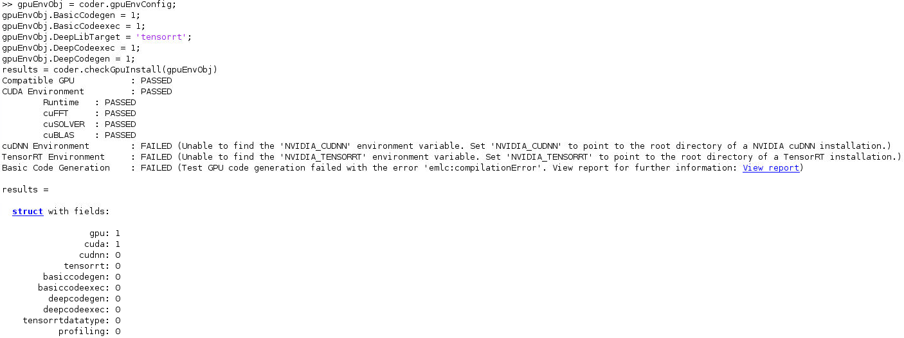

- [Create an image based on the matlab-ssh image that provides VNC services](#create-an-image-based-on-the-matlab-ssh-image-that-provides-vnc-services)
  - [1. Prepare base image](#1-prepare-base-image)
  - [2. Clone from github](#2-clone-from-github)
  - [3. Build image from dockerfile](#3-build-image-from-dockerfile)
- [Use image](#use-image)
  - [1. Run docker container](#1-run-docker-container)
  - [2. Use noVNC service](#2-use-novnc-service)
- [Current GPU environment](#current-gpu-environment)
- [TODO](#todo)
  - [- [ ] git clone specific commit](#ul-class%22contains-task-list%22-li-class%22task-list-item%22input-class%22task-list-item-checkbox%22-disabled%22%22-type%22checkbox%22-git-clone-specific-commitli-ul)


# Create an image based on the matlab-ssh image that provides VNC services

## 1. Prepare base image
Please refer to matlab-ssh directory to create base image.

## 2. Clone from github
Change "kai\/matlab-ssh:gpu" to your desired image at last "sed" command in gitclone.sh. 

Clone source code and modify some parts by this command.
```bash
bash gitclone.sh
```

## 3. Build image from dockerfile
You can change variables in [build.sh](build.sh).
```bash
bash build.sh
```

# Use image 
## 1. Run docker container
You can change variables in [run.sh](run.sh).

Note:
1. If your Docker CE version is v18, you should change the corresponding part of the option "gpus".
2. uid and gid are important.

```bash
bash run.sh
```

## 2. Use noVNC service
1. Open a web browser and type "<ip>: <port>" in the top search panel to use the container (note: Default port is 6901).
2. Enter noVNC's connection password (note: default password is 12345678).
3. If you want to use matlab, you can click "Applications/Terminal Emulator" on the top left panel. Then, enter "matlab" to activate matlab. After activating matlab, you can enter "matlab" again to open the command window of matlab (note: do not close the terminal). **Enjoy matlab!**
> If there is a problem with the display figures of matlab, you can try entering "opengl hardward" or "opengl hardwarebasic".


---
# Current GPU environment



---
# TODO
- [ ] support bash arguments parsing to facilitate the use of scripts
- [ ] improve GPU environment at creating base images stage
- [ ] git clone specific commit
---
> References:
> - [Matlab -- Setting Up the Prerequisite Products](https://www.mathworks.com/help/gpucoder/gs/setting-up-the-toolchain.html)
> - [Matlab -- GPU Support by Release](https://www.mathworks.com/help/parallel-computing/gpu-support-by-release.html)
> - [GitHub -- Calipsoplus/base-container-template](https://github.com/Calipsoplus/base-container-template)
> - [GitHub -- ConSol/docker-headless-vnc-container](https://github.com/ConSol/docker-headless-vnc-container)